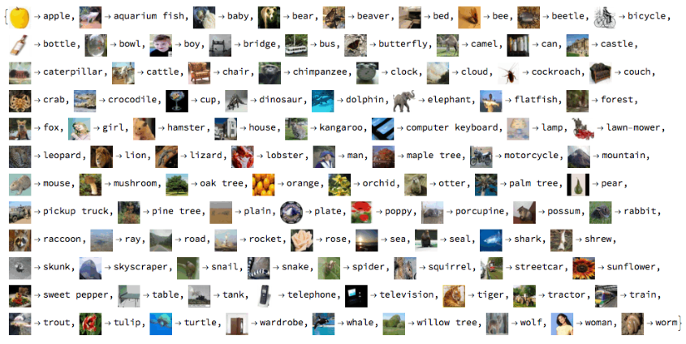

# MNIST DataBase

---

####     MNIST DataBase 란?

>National Institute of Standards and Technology의 줄임말이며, NIST의 손으로 쓴 글자 Dataset 에서 숫자만 따로 뽑아낸 Dataset 이다. 0 ~ 255 사이의 값을 가지는 흑백 이미지, 28 x 28, 70,000개의 이미지 ( 60,000 개의 Training Set & 10,000 Test Set ) 으로 구성되어있다.


####     왜 사용하는가?

​	1. 다른 DataSet보다 비교적 구하기 쉽다는 장점과  이미지 형태부터 __csv__ 형식까지 편하게 선택할 수 있다는 장점을 가지고 있다. 여기서 csv 형식이란 comma - separated values 의 약자이며 몇 가지 필드를 __쉼표(,)__ 로 구분한 텍스트 데이터 및 텍스트 파일을 말한다.


```python
# tensorflow
from tf.examples.tutorials.mnist import input_data
mnist = imput_data.read_data_sets()

# keras
import keras
(x_train, y_train),(x_test, y_test) = keras.datasets.mnist.load_data()
```

특히, 파일을 전부 다운로드하는 수고도 필요 없이 사용하고 싶은 Package에서 두 세줄 가져와 사용할 수 있다.


2. __모델의 성능을 확인하기 쉽다. __

뉴럴넷 모델들이 __성과 개선 (feature importance)__ 을 알려주지 않아 예측 결과와 feature 사이의 거리를 파악하기 힘들다는 단점이 있지만, MNIST DateSet으로 예측한 결과는 눈으로 좋고 나쁨을 직관적으로 확인할 수 있다.

성능이 좋은 모델인지 아닌지는 그저 눈으로 확인한 Test Image가 직관적으로 읽기 쉬운 숫자인지 아닌지를 판단해보면 알 수 있기 때문이다.


​	3.__좋은 성능이 쉽게 나온다.__

 간단한 모델 구성으로도 비교적 좋은 성능이 나오는 데다가 모델 구성별로 대략의 baseline 성능도 알려져 있기 때문에 그래프가 정상적으로 작성되었는지, hyperparametet는 적당한 값인지, 쉽게 판단이 가능하다.

각 모델별의 성능은 아래와 같다고 한다.

|           __Linear Classifier__            | __92.4%__  |
| :----------------------------------------: | ---------- |
|       __Neural Network (2 layer )__        | __98.4%__  |
|       __Neural Network (6 layer )__        | __99.65%__ |
| __Convolution Neural Network ( 6 layer )__ | __99.79%__ |


---

 ##  Similar Datasets

>MNIST와 유사하되 조금 더 실생활에 근접한 데이터들로 구성된 DataSet들도 있다. 다음과 같이 Fashion MNIST,  CIFAR 10, CIFAR 100 등이 있다.




이상으로 MNIST DataBase에 대한 포스팅을 마무리 하려 한다.

AI를 공부하는 과정에서 DataBase, DataSet을 공부하는것은 꼭 거쳐가야하는 과정인것같다.

타 공부를 하면서 병행하며 공부해야겠다고 느꼈다.